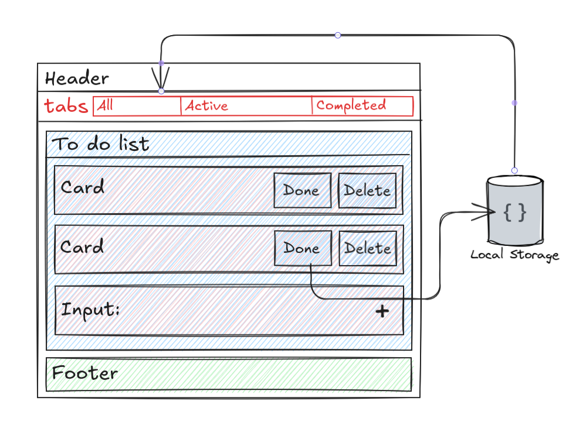

## Doit — Minimal To‑Do (React + Vite)

A single-page To‑Do app built with React and Vite.

## Features

- Add, complete, and delete todos
- Filter by Active / Completed
- Persistent data in `localStorage`
- Minimal and responsive interface

## Components & Data Flow


- `App.jsx` owns the state and passes props down to presentational components: `Header`, `Tabs`, `TodoList`, `TodoInput`, `Footer`.

- UI actions trigger handlers in `App.jsx` which update state and save data to `localStorage`.

## Key Patterns

- Todos have unique ids (`crypto.randomUUID()`), `title`, and `completed` status.

- State updates are immutable; handlers create new arrays when adding, completing, or deleting todos.

- Data persists in `localStorage` under the key `todo-app`.

## Getting Started

1. **Clone the repository**  
```bash
git clone https://github.com/iamAmer/doit.git
cd doit
```

2. **Install dependencies**  
```bash
npm install
```

3. **Run the development server**  
```bash
npm run dev
```
4. **Open the app in your browser: **
```bash
http://localhost:5173
```